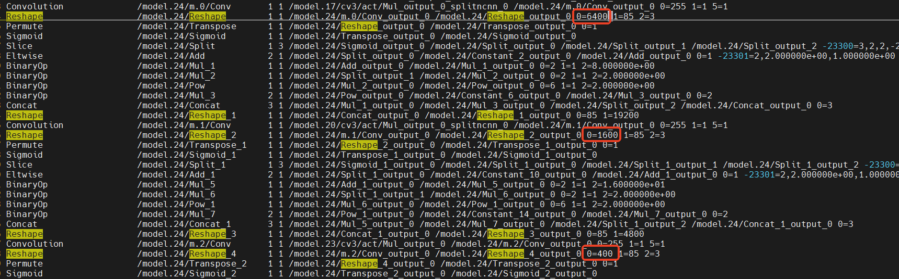
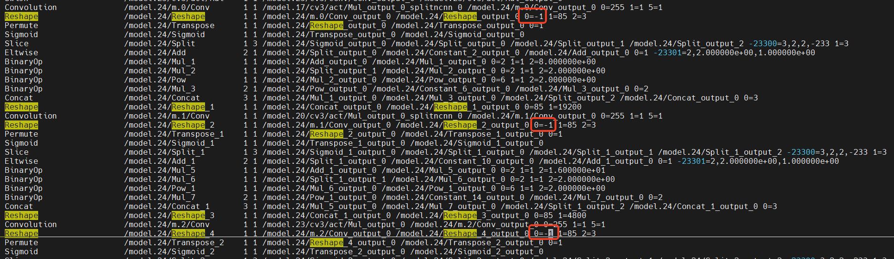
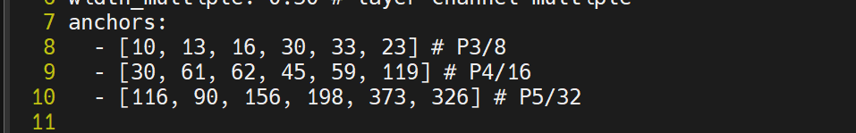
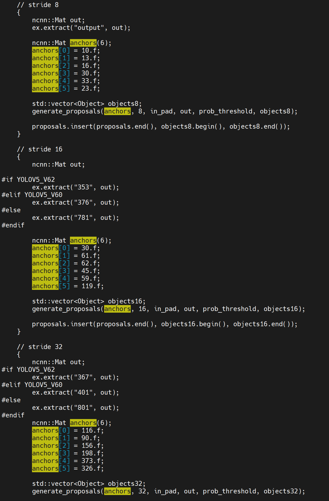
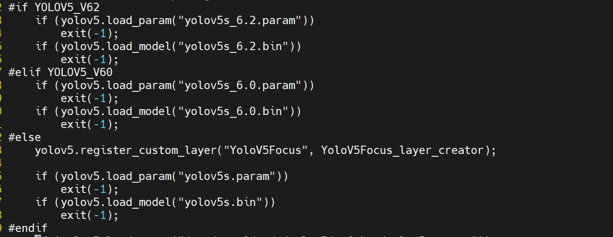

## 树莓派 NCNN 部署 yolov5（fp32/fp16）

github 项目仓库：https://github.com/Taot-chen/raspberrypi_dl


### 1 模型准备

* 拉取代码仓库
```bash
git clone https://github.com/Taot-chen/raspberrypi_dl.git
```
也可以直接在 github 下载仓库的压缩包到本地。

* 下载 yolov5s 预训练权重
```bash
cd raspberrypi_dl/deploy_yolov5_with_ncnn
./download_yolov5s_weight.sh
```

* 转 onnx 模型
```bash
python3 export_torch2onnx.py
```
转出来的 onnx 模型和权重会默认保存在 `./weights/` 下面。

* infer yolov5 with torch
```bash
git clone git@github.com:ultralytics/yolov5.git
cd yolov5
cp ../infer_yolo_torch_cpu.py ./
cp -r ../weights ./
python3 infer_yolo_torch_cpu.py
```

* 转 ncnn 模型
  **编译 ncnn，下面两种方式选一种即可**
  * x86 linux 机器上（ubuntu18.04）
    ```bash
        # clone ncnn 代码
        git clone git@github.com:Tencent/ncnn.git
        cd ncnn
        git submodule update --init

        # 安装基本依赖
        sudo apt install build-essential git cmake libprotobuf-dev protobuf-compiler libomp-dev libvulkan-dev vulkan-utils libopencv-dev

        # 编译 ncnn
        cd ncnn
        mkdir -p build
        cd build
        # build
        cmake -GNinja -DCMAKE_BUILD_TYPE=Release -DNCNN_VULKAN=ON -DNCNN_BUILD_EXAMPLES=ON ..
        ninja
        # 也可以这样 build
        cmake -DCMAKE_BUILD_TYPE=Release -DNCNN_VULKAN=ON -DNCNN_BUILD_EXAMPLES=ON ..
        make -j64
    ```
  * Raspberry Pi 上
    ```bash
        # clone ncnn 代码
        git clone git@github.com:Tencent/ncnn.git
        cd ncnn
        git submodule update --init

        # 安装基本依赖
        sudo apt install build-essential git cmake libprotobuf-dev protobuf-compiler libomp-dev libvulkan-dev vulkan-tools libopencv-dev

        # 编译 ncnn
        cd ncnn
        mkdir -p build
        cd build
        cmake -DCMAKE_BUILD_TYPE=Release -DNCNN_VULKAN=ON -DNCNN_BUILD_EXAMPLES=ON ..
        make -j$(nproc)
        # 也可以使用 ninja build，参照 x86 linux 机器的命令
    ```
  * 验证 ncn
    ```bash
      cd ../examples
      ../build/examples/squeezenet ../images/256-ncnn.png
      [0 V3D 7.1.7]  queueC=0[1]  queueG=0[1]  queueT=0[1]
      [0 V3D 7.1.7]  bugsbn1=0  bugbilz=0  bugcopc=0  bugihfa=0
      [0 V3D 7.1.7]  fp16-p/s/u/a=1/1/1/0  int8-p/s/u/a=1/1/1/0
      [0 V3D 7.1.7]  subgroup=16  basic/vote/ballot/shuffle=1/0/0/0
      [0 V3D 7.1.7]  fp16-8x8x16/16x8x8/16x8x16/16x16x16=0/0/0/0
      [1 llvmpipe (LLVM 15.0.6, 128 bits)]  queueC=0[1]  queueG=0[1]  queueT=0[1]
      [1 llvmpipe (LLVM 15.0.6, 128 bits)]  bugsbn1=0  bugbilz=0  bugcopc=0  bugihfa=0
      [1 llvmpipe (LLVM 15.0.6, 128 bits)]  fp16-p/s/u/a=1/1/1/1  int8-p/s/u/a=1/1/1/1
      [1 llvmpipe (LLVM 15.0.6, 128 bits)]  subgroup=4  basic/vote/ballot/shuffle=1/1/1/1
      [1 llvmpipe (LLVM 15.0.6, 128 bits)]  fp16-8x8x16/16x8x8/16x8x16/16x16x16=0/0/0/0
      532 = 0.165649
      920 = 0.094360
      716 = 0.062378
    ```
    也可以通过跑 benchmark 来验证：
    ```bash
    cd ../benchmark
    ../build/benchmark/benchncnn 10 $(nproc) 0 0
    [0 V3D 7.1.7]  queueC=0[1]  queueG=0[1]  queueT=0[1]
    [0 V3D 7.1.7]  bugsbn1=0  bugbilz=0  bugcopc=0  bugihfa=0
    [0 V3D 7.1.7]  fp16-p/s/u/a=1/1/1/0  int8-p/s/u/a=1/1/1/0
    [0 V3D 7.1.7]  subgroup=16  basic/vote/ballot/shuffle=1/0/0/0
    [0 V3D 7.1.7]  fp16-8x8x16/16x8x8/16x8x16/16x16x16=0/0/0/0
    [1 llvmpipe (LLVM 15.0.6, 128 bits)]  queueC=0[1]  queueG=0[1]  queueT=0[1]
    [1 llvmpipe (LLVM 15.0.6, 128 bits)]  bugsbn1=0  bugbilz=0  bugcopc=0  bugihfa=0
    [1 llvmpipe (LLVM 15.0.6, 128 bits)]  fp16-p/s/u/a=1/1/1/1  int8-p/s/u/a=1/1/1/1
    [1 llvmpipe (LLVM 15.0.6, 128 bits)]  subgroup=4  basic/vote/ballot/shuffle=1/1/1/1
    [1 llvmpipe (LLVM 15.0.6, 128 bits)]  fp16-8x8x16/16x8x8/16x8x16/16x16x16=0/0/0/0
    loop_count = 10
    num_threads = 4
    powersave = 0
    gpu_device = 0
    cooling_down = 1
              squeezenet  min =  122.88  max =  123.29  avg =  123.12
         squeezenet_int8  min =    8.97  max =   10.25  avg =    9.48
               mobilenet  min =  170.36  max =  170.85  avg =  170.47
          mobilenet_int8  min =    9.85  max =   10.14  avg =    9.97
            mobilenet_v2  min =  126.71  max =  127.30  avg =  126.93
            mobilenet_v3  min =  117.20  max =  117.87  avg =  117.53
              shufflenet  min =   69.44  max =   70.00  avg =   69.76
           shufflenet_v2  min =   92.52  max =   93.30  avg =   92.84
                 mnasnet  min =  121.98  max =  122.34  avg =  122.15
         proxylessnasnet  min =  125.30  max =  125.97  avg =  125.59
         efficientnet_b0  min =  195.53  max =  196.21  avg =  195.89
         ...
    ```


  * onnx 转 ncnn
    ```bash
    # in path: /path/to/raspberrypi_dl/deploy_yolov5_with_ncnn/
    mkdir ncnn_model
    /path/to/ncnn/build/tools/onnx/onnx2ncnn weights/yolov5s.onnx ncnn_model/yolov5s.param ncnn_model/yolov5s.bin
    /path/to/ncnn/build/tools/ncnnoptimize  ncnn_model/yolov5s.param ncnn_model/yolov5s.bin ncnn_model/yolov5s-opt.param ncnn_model/yolov5s-opt.bin 65536
    ```
* 动态 shape 支持
    为了实现动态尺寸图片处理，需要对`yolov5s.param`的 reshape 操作进行修改：
    修改前：
    
    修改后：
    


### 2 后处理修改

ncnn官方的yolov5.cpp需要修改两处地方:

* anchor 信息是在 yolov5s 代码 models/yolov5ss-1.0.yaml，需要根据自己的数据集聚类后的 anchor 进行对应的修改
* 输出层 ID 在 Permute 层里边，也需要进行相应的修改
我这里的如下：
  
  对应的，需要修改 ncnn/examples/yolov5.cpp
  
  这里修改成和 models/yolov5ss-1.0.yaml 里面一致即可。

另外，还需要将 ncnn/examples/yolov5.cpp 里面加载模型的路径换成自己转出来的 yolov5s 的模型:


重新 make 就可以进行检测：
```bash
cd ncnn/build
make -j4
cd ncnn/build/examples
./yolov5 [imagepath]
```
fp32 检测结果：


fp16 检测结果：


fp16 的检测结果和 fp32 的检测结果一致，但是概率上有细微差别，速度更快一些。

### 3 添加推理时间计算

```bash
cp yolov5.cpp /path/to/ncnn/examples/yolov5.cpp
```

之后再重新编译 ncnn 即可。